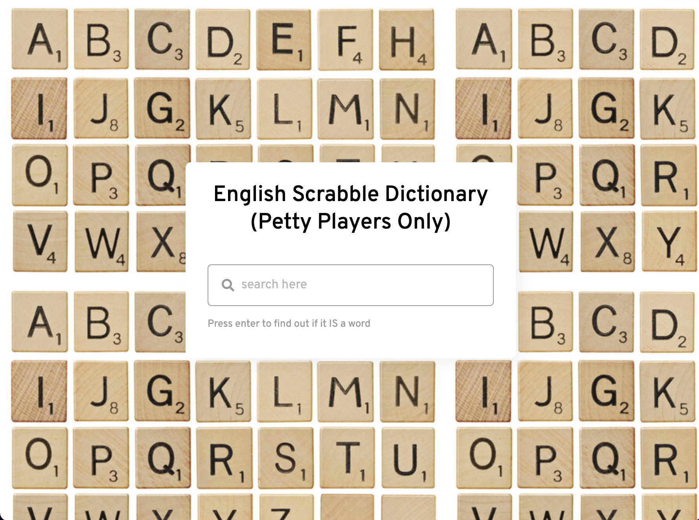
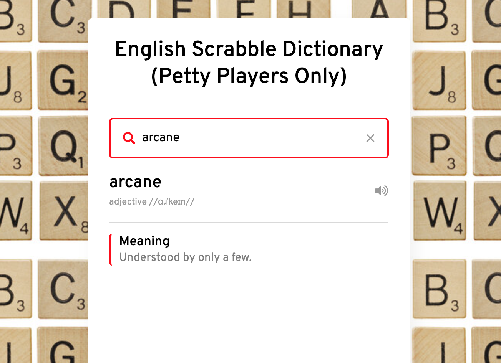
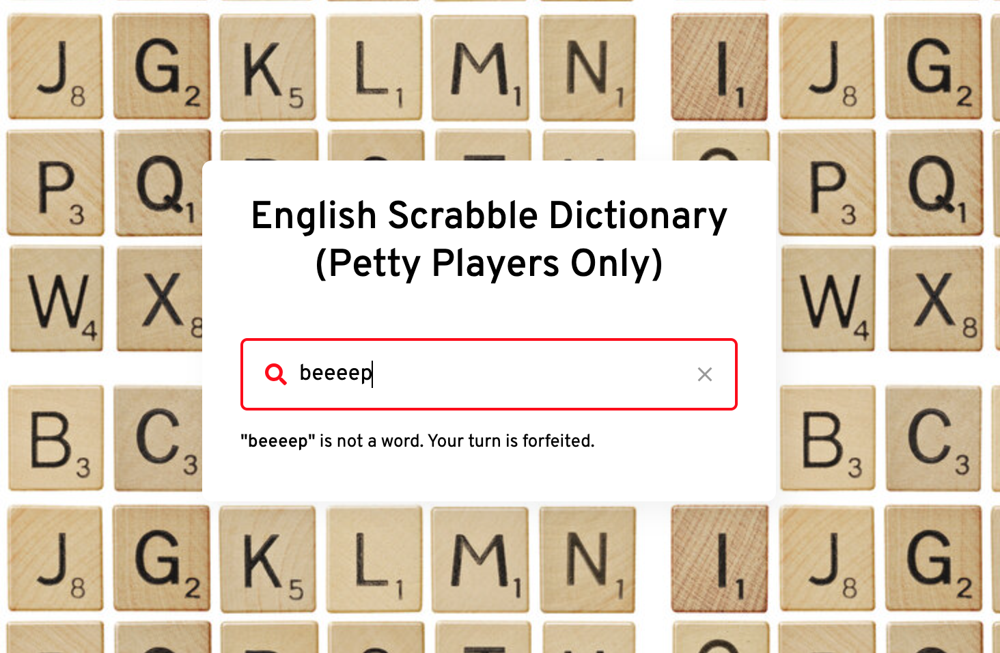

# Scrabble Dictionary for Petty Players Only

## Table of Contents

- [About](#about)
- [Get started](#start)
- [Functionalities](#fun)
- [Technology](#tech)
- [Screenshots](#demo)

## About 
Are you a petty player tired of having to always prove your word is a real word? 

Me too. 

So I've made a dictionary clone so you can demolish your challenges efficiently.

## Start 
Open index.html with live server.

## Functionalities 
Enter characters in text input area, definition provided if it is a word and error message if not.

## Technology 
HTML, CSS, and JavaScript

## Screenshots 

